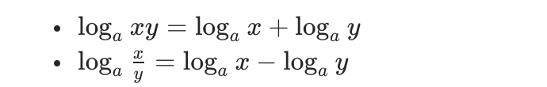

## [剑指 Offer 55 - I. 二叉树的深度](https://leetcode-cn.com/problems/er-cha-shu-de-shen-du-lcof/)  

### 解题思路

关于求解 二叉树深度 问题最容易想到的是用递归的方式：将问题拆解，求二叉树深度，可以理解为**求 root 节点左右子树的深度**，然后取左右子树中较大的那个数加一，即可得到整棵树的深度。  
1. 递推函数做的工作：  
  a. 计算 root 左子树的深度，调用 maxDepth(root.left);
  b. 计算 root 右子树的深度，调用 maxDepth(root.right);  
2. 递归的终止条件： 当传给 递归函数 的节点为空时，说明没有结点，此时函数返回 0;
3. 递归函数返回值： 左右子树深度最大值加一，即 max(maxDepth(root.left), maxDepth(root.right)) + 1 ;  
  
除了上面这种解法以外，还有一种按层遍历的解法：
1. 特殊处理： 当 root 节点为空时，直接返回 0 ；
2. 定义一个数组（currentFloor）和计数器变量，数组用来存放当前 层 的所有节点，计数器用于遍历时记录二叉树层数；  
3. 循环遍历：当 currentFloor 长度为 0 时，终止遍历。  
  a. 申明一个临时数组 temp ，用来存储下一层的节点；  
  b. 遍历当前层（currentFloor）的所有节点，将该层节点的所有子节点 push 进 temp 中；  
  c. 计数器值加一；  
  d. 将下一层的节点数组赋值给 currentFloor ，即 currentFloor = temp
4. 返回值：返回计数器的值即可；  

```js
// 后序遍历 递归解法
var maxDepth = function(root) {
    if(!root) return 0
    return Math.max(maxDepth(root.right), maxDepth(root.left)) + 1
};

// 层序遍历 队列循环解法
var maxDepth = function(root) {
    if(!root) return 0
    let depthes = 0
    let currentFloor = [root]

    while(currentFloor.length) {
        const temp = []
        currentFloor.forEach(item => {
            if(!!item.left) temp.push(item.left);
            if(!!item.right) temp.push(item.right);
        })
        depthes = depthes + 1
        currentFloor = temp
    }

    return depthes
}
```  

==========================================================>  

## [剑指 Offer 64. 求1+2+…+n](https://leetcode-cn.com/problems/qiu-12n-lcof/)   

### 解题思路  
这个问题很容易想到的一个思路就是用递归来解决，但题目中规定无法用条件判断语句，没有条件判断语句我们就找不到递归函数的出口...  
除了题目中禁止的用的语法语句，我们还剩下 加减法，赋值，位运算符以及逻辑运算符 这些工具  
所以要完成判断语句的「判断功能」，我们可以利用 逻辑运算符的短路性质。  
例如： A&&B ，A、B 都为表达式，只有 A 表达式为 true 时，B 表达式才会执行，因为当 A 表达式为 false 时，A&&B 的值就已经确定了，同理 A||B 当 A 为 false 时，B 表达式才会执行....  

利用上面这个特性我们就可以结合递归解决这道题：  
```js  
var sumNums = function(n) {
    n && (n = sumNums(n-1) + n)
    return n
};
```  

在 leetcode 还看到一种解法，觉得挺取巧。它的解题思路是：1+2+3+...+n 这种题目在高中数学中，利用等差数列求和公式就能求出来，具体公式如下：


所以 1+2+3+...+n === n*(n+1)/2 ,题目中规定不能用乘除法，所以我们可以运用**对数**，将乘法变为加法，除法变成减法。  

     

值得注意的是：***对数和幂运算有浮点误差，最终通过取整消除误差。***   
相关代码：  
```js  
var sumNums = function (n) {
    return Math.round(Math.exp(Math.log(n) + Math.log(n + 1) - Math.log(2)));
};
```